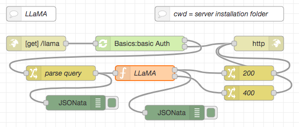
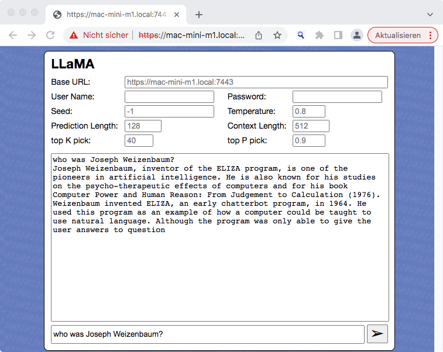

# node-red-flow-llama #

Node-RED Flow (and web page example) for the LLaMA AI model

This repository contains a function node for [Node-RED](https://nodered.org/) which can be used to run the [LLaMA model](https://ai.facebook.com/blog/large-language-model-llama-meta-ai/) using [llama.cpp](https://github.com/ggerganov/llama.cpp) within a Node-RED flow. **Inference is done on the CPU** and still completes within a few seconds on a reasonably powerful computer.

Having the actual inference as a self-contained function node gives you the possibility to define your own user interface or even use it as part of an autonomous agent.

> Nota bene: these flows do not contain the actual model. You will have to request your own copy directly from Meta AI using their official [Request Form](https://docs.google.com/forms/d/e/1FAIpQLSfqNECQnMkycAp2jP4Z9TFX0cGR4uf7b_fBxjY_OjhJILlKGA/viewform).

## Installation ##

Start by creating a subfolder called `ai` within the installation folder of your Node-RED server. This subfolder will later store both the executable and the actual model. Using such a subfolder helps keeping the folder structure of your server clean if you decide to play with other AI models as well.

### Building the Executable ###

The actual "heavy lifting" is done by [llama.cpp](https://github.com/ggerganov/llama.cpp). Simply follow the instructions found in section [Usage](https://github.com/ggerganov/llama.cpp#usage) of the llama.cpp docs to build the `main` executable for your platform.

Afterwards, rename `main` to `llama` and copy it into the subfolder `ai` you created before.

### Preparing the Model ###

Once you got the actual LLaMA model, follow the instructions found in section [Prepare Data & Run](https://github.com/ggerganov/llama.cpp#prepare-data--run) of the llama.cpp docs to bring it into the proper format.

> Nota bene: right now, the function node supports the 7B model only - but this may easily be changed in the function source

Afterwards, rename the file `ggml-model-q4_0.bin` to `ggml-llama-7b-q4.bin` and move (or copy) it into the same subfolder `ai` where you already placed the `llama` executable.

### Importing the Function Node ###

Finally, open the Flow Editor of your Node-RED server and import the contents of [LLaMA-Function.json](./LLaMA-Function.json). After deploying your changes, you are ready to run LLaMA inferences directly from within Node-RED.

## Usage ##

The prompt itself and any inference parameters have to be passed as properties of the msg object. The prompt is expected in `msg.payload` and will later be replaced by the result of the inference.

The following properties are supported:

* `payload` - this is the actual prompt 
* `seed` - seed value for the internal pseudo random number generator (integer, default: -1, use random seed for <= 0)
* `threads` - number of threads to use during computation (integer ≧ 1, default: 4)
* `context` - size of the prompt context (integer ≧ 0, default: 512)
* `keep` - number of tokens to keep from the initial prompt (integer ≧ -1, default: 0, -1 = all)
* `predict` - number of tokens to predict (integer ≧ -1, default: 128, -1 = infinity)
* `topk` - top-k sampling limit (integer ≧ 1, default: 40)
* `topp` - top-p sampling limit (0.0...1.0, default: 0.9)
* `temperature` - temperature (0.0...1.0, default: 0.8)
* `batches` - batch size for prompt processing (integer ≧ 1, default: 8)

All properties (except the prompt itself) are optional. If given, they should be strings (even if they contain numbers), this makes it simpler to extract them from an HTTP request.

## Example ##

The file [LLaMA-HTTP-Endpoint.json](./LLaMA-HTTP-Endpoint.json) contains an example which uses the LLaMA function node to answer HTTP requests. The prompt itself and any inference parameters have to be passed as query parameters, the result of the inference will then be returned in the body of the HTTP response.

> Nota bene: the screenshot from above shows a modified version of this flow including an authentication node from the author's [Node-RED Authorization Examples](https://github.com/rozek/node-red-authorization-examples), the flow in [LLaMA-HTTP-Endpoint.json](./LLaMA-HTTP-Endpoint.json) comes without any authentication.

The following parameters are supported (most of them will be copied into a `msg` property of the same name):

* `prompt` - will be copied into `msg.payload`
* `seed` - will be copied into `msg.seed`
* `threads` - will be copied into `msg.threads`
* `context` - will be copied into `msg.context`
* `keep` - will be copied into `msg.keep`
* `predict` - will be copied into `msg.predict`
* `topk` - will be copied into `msg.topk`
* `topp` - will be copied into `msg.topp`
* `temperature` - will be copied into `msg.temperature`
* `batches` - will be copied into `msg.batches`

In order to install this flow, simply open the Flow Editor of your Node-RED server and import the contents of [LLaMA-HTTP-Endpoint.json](./LLaMA-HTTP-Endpoint.json)

### Web Page ###

The file [LLaMA.html](./LLaMA.html) contains a trivial web page which can act as a user interface for the HTTP endpoint. Ideally, this page should be served from the same Node-RED server that also accepts the HTTP requests for LLaMA, but this is not strictly necessary.

> Nota bene: **inference is still done on the Node-RED server**, not within your browser!

## License ##

[MIT License](LICENSE.md)
